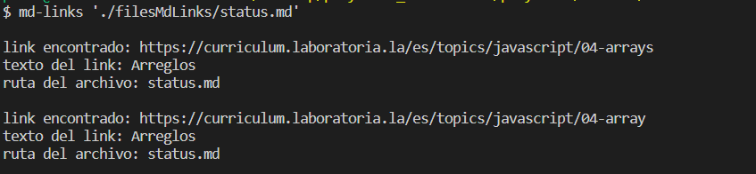
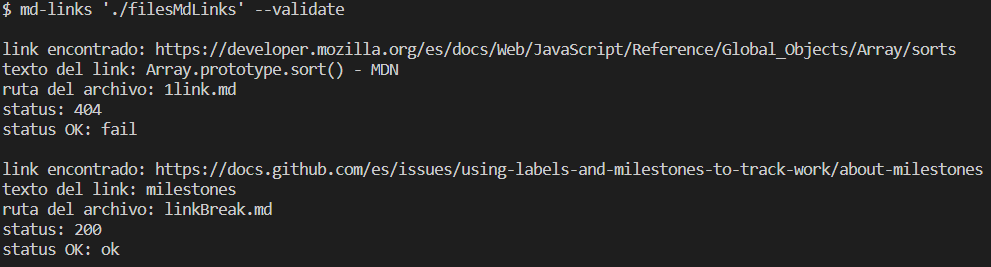
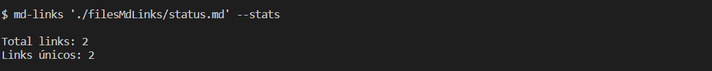
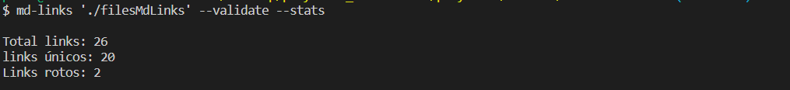
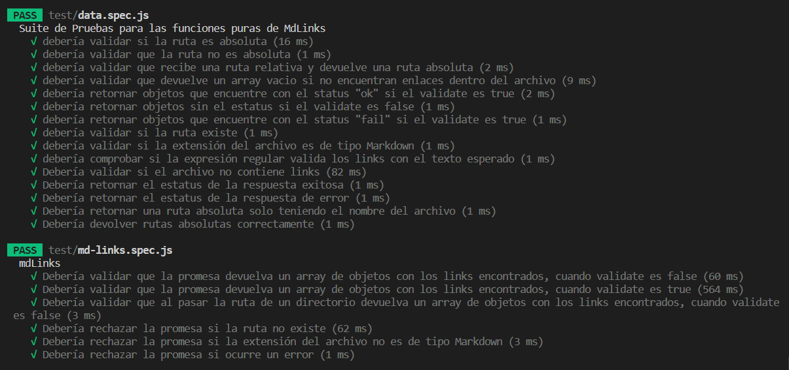

# Markdown Links

## Índice

* [1. Preámbulo](#1-preámbulo)
* [2. Resumen del proyecto](#2-resumen-del-proyecto)
* [3. Como utilizar la libreria de Md-links a tráves de la terminal:](#3-como-utilizar-la-libreria-de-md-links-a-tráves-de-la-terminal)
* [4. Intalación](#4-instalación)
* [5. Pruebas unitarias](#5-pruebas-unitarias)
* [6. Diagrama de flujo](#6-diagrama-de-flujo)
* [7. Organización](#7-organización-del-proyecto)
* [8. Objetivos de aprendizaje](#8-objetivos-de-aprendizaje)


***

## 1. Preámbulo

Markdown es un lenguaje de marcado sencillo utilizado por la comunidad de desarrolladores web y escritores para formatear contenido en línea. Su popularidad se debe a su facilidad de uso, legibilidad, amplia compatibilidad, versatilidad y capacidad de funcionar en diferentes entornos. Markdown simplifica la creación de contenido en la web, lo que ahorra tiempo y esfuerzo al permitir a los usuarios centrarse en el contenido en lugar de la complejidad del formato.

Es muy común encontrar varios archivos en ese formato en cualquier tipo de
repositorio (empezando por el tradicional README.md). Estos archivos Markdown normalmente contienen _links_ (vínculos/ligas) que
muchas veces están rotos o ya no son válidos y eso perjudica mucho el valor de
la información que se quiere compartir.


## 2. Resumen del proyecto

Md-Links es una biblioteca en Node.js que funciona como una herramienta para analizar enlaces dentro de archivos Markdown. Esta biblioteca está disponible como un módulo publicado en GitHub y como una interfaz de línea de comandos (CLI) que permite utilizar la biblioteca directamente desde la terminal.

Md-Links tiene la capacidad de leer archivos Markdown y extraer los enlaces encontrados en ellos. Además, proporciona información relevante sobre cada enlace, como el texto del enlace, el archivo en el que se encuentra y el estado del enlace, ya sea que esté funcionando o roto. También ofrece estadísticas, como la cantidad total de enlaces encontrados, la cantidad de enlaces no repetidos y la cantidad de enlaces rotos.

Con Md-Links, simplificamos la tarea de analizar y gestionar enlaces en archivos Markdown, lo que lo convierte en una herramienta útil para quienes trabajan con documentación y contenidos en este formato.


## 3. Como utilizar la libreria de Md-Links a tráves de la terminal:

### Comando md-links
Para comenzar a utilizar Md-Links es necesario escribir el comando ```md-links``` + escribir ```el path ```(ruta absoluta o relativa del proyecto donde se está trabajando, este path puede ser de un archivo o de un directorio) en caso de no localizar la ruta se mostrara un mensaje con el error.

* comando md-links + path de un ```directorio específico```:
  Verifica que el archivo sea de tipo Markdown y muestra cada uno de los links encontrados dentro del archivo.

* comando md-links + path de un ```directorio```:
  Busca todos los archivos de tipo Markdown que se localicen dentro del directorio y devuelve la información de cada uno de los links encontrados.

En ambas alternativas de path devolverá información de los links encontrados correspondiente al:
* link encontrado,
* texto del link y,
* ruta del archivo.

Como se muestra a continuación:



### Comandos opcionales

También podemos utilizar los siguientes comandos opcionales (--validate y --stats) que nos proporcionan información sobre cada de uno de los enlaces encontrados.

* ```--validate```:  
 al utilizar el comando ```md-links``` + path (indicar la ruta) + el comando ```--validate``` devolvera la información de todos los links encontrados y adicionalmente se agregara la informacion del estatus de respuesta positiva 'ok' o negativa 'fail'.

    #### Tipos de valor al consultar el estatus:

    ```status 200``` significa que al acceder a ese enlace, el servidor web ha podido encontrar y entregar el recurso solicitado, ya que indica que el recurso solicitado está disponible y se ha entregado correctamente.

    ```status 404``` recursos no encontrados.

    ```status 500``` problemas en el servidor.

    

* ```--stats```:  
 al utilizar el comando ```md-links``` + path (indicar la ruta) + el comando ``` --stats ```, solo devolvera las estadisticas de los enlaces encontrados dentro del archivo o directorio solicitado (total de links, links no repetidos).


  


### Combinación de comandos --validate y --stats

Podemos combinar los comandos ```--validate``` y ```--stats``` para obtener una estadistica adicional relacionada al estatus del enlace (muestra los links rotos):

  

## 4. Instalación

Podemos instalar ejecutando en la terminal el siguiente comando:
<pre> instalacion <code>

```npm install patychavezromo/DEV009-md-links```

## 5. Pruebas Unitarias
Se realizarón las pruebas unitarias para validar los modulos de data.js e index.js:




## 6. Diagrama de Flujo

## 7. Organización del proyecto

## 8. Objetivos de aprendizaje

### JavaScript

- [x] **Diferenciar entre tipos de datos primitivos y no primitivos**

- [x] **Arrays (arreglos)**

  <details><summary>Links</summary><p>

  * [Arreglos](https://curriculum.laboratoria.la/es/topics/javascript/04-arrays)
  * [Array - MDN](https://developer.mozilla.org/es/docs/Web/JavaScript/Reference/Global_Objects/Array/)
  * [Array.prototype.sort() - MDN](https://developer.mozilla.org/es/docs/Web/JavaScript/Reference/Global_Objects/Array/sort)
  * [Array.prototype.forEach() - MDN](https://developer.mozilla.org/es/docs/Web/JavaScript/Reference/Global_Objects/Array/forEach)
  * [Array.prototype.map() - MDN](https://developer.mozilla.org/es/docs/Web/JavaScript/Reference/Global_Objects/Array/map)
  * [Array.prototype.filter() - MDN](https://developer.mozilla.org/es/docs/Web/JavaScript/Reference/Global_Objects/Array/filter)
  * [Array.prototype.reduce() - MDN](https://developer.mozilla.org/es/docs/Web/JavaScript/Reference/Global_Objects/Array/Reduce)
</p></details>

- [x] **Objetos (key, value)**

  <details><summary>Links</summary><p>

  * [Objetos en JavaScript](https://curriculum.laboratoria.la/es/topics/javascript/05-objects/01-objects)
</p></details>

- [x] **Uso de condicionales (if-else, switch, operador ternario, lógica booleana)**

  <details><summary>Links</summary><p>

  * [Estructuras condicionales y repetitivas](https://curriculum.laboratoria.la/es/topics/javascript/02-flow-control/01-conditionals-and-loops)
  * [Tomando decisiones en tu código — condicionales - MDN](https://developer.mozilla.org/es/docs/Learn/JavaScript/Building_blocks/conditionals)
</p></details>

- [x] **Funciones (params, args, return)**

  <details><summary>Links</summary><p>

  * [Funciones (control de flujo)](https://curriculum.laboratoria.la/es/topics/javascript/02-flow-control/03-functions)
  * [Funciones clásicas](https://curriculum.laboratoria.la/es/topics/javascript/03-functions/01-classic)
  * [Arrow Functions](https://curriculum.laboratoria.la/es/topics/javascript/03-functions/02-arrow)
  * [Funciones — bloques de código reutilizables - MDN](https://developer.mozilla.org/es/docs/Learn/JavaScript/Building_blocks/Functions)
</p></details>

- [ ] **Recursión o recursividad**

  <details><summary>Links</summary><p>

  * [Píldora recursión - YouTube Laboratoria Developers](https://www.youtube.com/watch?v=lPPgY3HLlhQ)
  * [Recursión o Recursividad - Laboratoria Developers en Medium](https://medium.com/laboratoria-developers/recursi%C3%B3n-o-recursividad-ec8f1a359727)
</p></details>

- [x] **Módulos de CommonJS**

  <details><summary>Links</summary><p>

  * [Modules: CommonJS modules - Node.js Docs](https://nodejs.org/docs/latest/api/modules.html)
</p></details>

- [x] **Diferenciar entre expresiones (expressions) y sentencias (statements)**

- [x] **Callbacks**

  <details><summary>Links</summary><p>

  * [Función Callback - MDN](https://developer.mozilla.org/es/docs/Glossary/Callback_function)
</p></details>

- [x] **Promesas**

  <details><summary>Links</summary><p>

  * [Promise - MDN](https://developer.mozilla.org/es/docs/Web/JavaScript/Reference/Global_Objects/Promise)
  * [How to Write a JavaScript Promise - freecodecamp (en inglés)](https://www.freecodecamp.org/news/how-to-write-a-javascript-promise-4ed8d44292b8/)
</p></details>

- [x] **Pruebas unitarias (unit tests)**

  <details><summary>Links</summary><p>

  * [Empezando con Jest - Documentación oficial](https://jestjs.io/docs/es-ES/getting-started)
</p></details>

- [x] **Pruebas asíncronas**

  <details><summary>Links</summary><p>

  * [Tests de código asincrónico con Jest - Documentación oficial](https://jestjs.io/docs/es-ES/asynchronous)
</p></details>

- [x] **Uso de mocks y espías**

  <details><summary>Links</summary><p>

  * [Manual Mocks con Jest - Documentación oficial](https://jestjs.io/docs/es-ES/manual-mocks)
</p></details>

- [ ] **Pruebas de compatibilidad en múltiples entornos de ejecución**

- [ ] **Uso de linter (ESLINT)**

- [x] **Uso de identificadores descriptivos (Nomenclatura y Semántica)**

### Node.js

- [x] **Instalar y usar módulos con npm**

  <details><summary>Links</summary><p>

  * [Sitio oficial de npm (en inglés)](https://www.npmjs.com/)
</p></details>

- [x] **Configuración de package.json**

  <details><summary>Links</summary><p>

  * [package.json - Documentación oficial (en inglés)](https://docs.npmjs.com/files/package.json)
</p></details>

- [x] **Configuración de npm-scripts**

  <details><summary>Links</summary><p>

  * [scripts - Documentación oficial (en inglés)](https://docs.npmjs.com/misc/scripts)
</p></details>

- [x] **process (env, argv, stdin-stdout-stderr, exit-code)**

  <details><summary>Links</summary><p>

  * [Process - Documentación oficial (en inglés)](https://nodejs.org/api/process.html)
</p></details>

- [x] **File system (fs, path)**

  <details><summary>Links</summary><p>

  * [File system - Documentación oficial (en inglés)](https://nodejs.org/api/fs.html)
  * [Path - Documentación oficial (en inglés)](https://nodejs.org/api/path.html)
</p></details>

### Control de Versiones (Git y GitHub)

- [] **Git: Instalación y configuración**

- [x] **Git: Control de versiones con git (init, clone, add, commit, status, push, pull, remote)**

- [x] **Git: Integración de cambios entre ramas (branch, checkout, fetch, merge, reset, rebase, tag)**

- [] **GitHub: Creación de cuenta y repos, configuración de llaves SSH**

- [x] **GitHub: Colaboración en Github (branches | forks | pull requests | code review | tags)**

- [x] **GitHub: Organización en Github (projects | issues | labels | milestones | releases)**

### HTTP

- [x] **Consulta o petición (request) y respuesta (response).**

  <details><summary>Links</summary><p>

  * [Generalidades del protocolo HTTP - MDN](https://developer.mozilla.org/es/docs/Web/HTTP/Overview)
  * [Mensajes HTTP - MDN](https://developer.mozilla.org/es/docs/Web/HTTP/Messages)
</p></details>

- [x] **Códigos de status de HTTP**

  <details><summary>Links</summary><p>

  * [Códigos de estado de respuesta HTTP - MDN](https://developer.mozilla.org/es/docs/Web/HTTP/Status)
  * [The Complete Guide to Status Codes for Meaningful ReST APIs - dev.to](https://dev.to/khaosdoctor/the-complete-guide-to-status-codes-for-meaningful-rest-apis-1-5c5)
</p></details>

## 4. Consideraciones generales

* Este proyecto se debe "resolver" de manera individual.

* El rango de tiempo estimado para completar el proyecto es de 3 a 5 sprints.

* Consideramos los hitos 1 y 2 como los criterios de aceptación mínimos del proyecto.

* Enfócate en aprender y no solamente en "completar" todos los hitos del proyecto.

* Te sugerimos que no intentes saber todo de Node.js antes de empezar a codear.
  No es necesario tomar un curso de Node.js completo. Aprenderás a medida que
  avances en el proceso.

## 5. Consideraciones técnicas

Para comenzar este proyecto tendrás que hacer un fork y clonar este repositorio.

* En este proyecto hay que adoptar las convenciones que los proyectos open
  source de software usan para hacer seguimiento. Vas a usar Github projects
  con **[issues](https://docs.github.com/es/issues)** y
  **[milestones](https://docs.github.com/es/issues/using-labels-and-milestones-to-track-work/about-milestones)**
  para priorizar y organizar el trabajo y hacer seguimiento de tu proceso.
  Dentro de cada milestone crearás los issues que
  consideres necesarios.

* La **librería** y el **script ejecutable** (herramienta de línea de comando -
  CLI) deben estar implementados en JavaScript para ser ejecutados con
  Node.js. **Está permitido usar librerías externas**.

* Tu módulo **debe ser instalable** via `npm install <github-user>/md-links`. Este
  módulo debe incluir tanto un _ejecutable_ que podamos invocar en la línea de
  comando como una interfaz que podamos importar con `require` para usarlo
  programáticamente.

* Los **tests unitarios** deben cubrir un mínimo del 70% de _statements_,
  _functions_, _lines_ y _branches_. Te recomendamos explorar [Jest](https://jestjs.io/)
  para tus pruebas unitarias.

* Para este proyecto **no está permitido** utilizar `async/await`.

* Para este proyecto, hay que decidir si vas a utilizar los módulos CommonJS
  o ES Modules. Los módulos CommonJS usan la síntaxis `require` y es el formato
  de módulos original de Node.js. Si prefieres utilizar ES Modules
  `(import/export)`, puedes hacerlo, pero ten en cuenta que
  deberás configurar adecuadamente tu proyecto para que Node.js pueda utilizar
  este formato. Puedes encontrar más información al respecto
  [aquí](https://nodejs.org/api/packages.html#determining-module-system). Además,
  tendrás que configurar Jest para ello también, siguiendo los
  [siguientes pasos](https://jestjs.io/docs/ecmascript-modules).
  Ten en consideración que Jest considera esto aún como un _feature
  experimental_.

* Para este proyecto, te recomendamos evitar el uso de la función síncrona
  `readFileSync` para leer archivos. En su lugar, te sugerimos abordar este
  desafío de manera asíncrona utilizando `readFile`. Además, si utilizas el
  módulo `fs/promises`, podrás utilizar la versión promisificada de las
  funciones como
  [`readFile`](https://nodejs.org/dist/latest-v18.x/docs/api/fs.html#fspromisesreadfilepath-options).

* Para disminuir la complejidad de tu algoritmo recursivo, te recomendamos
  utilizar la versión síncrona de la función para leer directorios, `readdirSync`.

### Descripción de los archivos del proyecto

* `README.md` con descripción del módulo, instrucciones de instalación/uso,
  documentación del API y ejemplos. Todo lo relevante para que cualquier
  developer que quiera usar tu librería pueda hacerlo sin inconvenientes.
* `index.js`: Desde este archivo debes exportar **una** función (`mdLinks`).
* `package.json` con nombre, versión, descripción, autores, licencia,
  dependencias, scripts (pretest, test, ...), main, bin
* `.editorconfig` con configuración para editores de texto. Este archivo no se
  debe cambiar.
* `.eslintrc` con configuración para linter. Este archivo contiene una
  configuración básica para ESLint, si deseas agregar reglas adicionales
  como Airbnb deberás modificar este archivo.
* `.gitignore` para ignorar `node_modules` u otras directorios que no deban
  incluirse en control de versiones (`git`).
* `test/md-links.spec.js` debe contener los tests unitarios para la función
  `mdLinks()`. Tu implementación debe pasar estos tests.

Este proyecto lo puedes ir construyendo por hitos. A continuación te sugerimos algunos:

## 6. Hitos

Recuerda que la mejor manera de abordar un problema es descomponiéndolo en
problemas más pequeños. Por esta razón, te recomendamos que completes este
proyecto trabajando por hitos. A continuación, encontrarás los hitos que puedes
seguir:

* [Hito 1](./docs/01-milestone.md)
* [Hito 2](./docs/02-milestone.md)
* [Hito 3](./docs/03-milestone.md)
* [Hito 4](./docs/04-milestone.md)
* [Hito 5](./docs/05-milestone.md)

## 7. Hacker edition

Las secciones llamadas _Hacker Edition_ son **opcionales**. Si **terminaste**
con todo lo anterior y te queda tiempo, intenta completarlas. Así podrás
profundizar y/o ejercitar más sobre los objetivos de aprendizaje del proyecto.

* Puedes agregar la propiedad `line` a cada objeto `link` indicando en qué línea
  del archivo se encontró el link.
* Puedes agregar más estadísticas.
* Integración continua con Travis o Circle CI.

***

## 8. Pistas, tips y lecturas complementarias

### **Inicia con un diagrama de flujo y/o pseudocódigo**

Este proyecto difiere de los anteriores en los que has trabajado, ya que no
implica una interfaz web. Todo el desarrollo se llevará a cabo en tu editor
y en la consola/terminal.

El proyecto se basa en un proceso lógico compuesto por diferentes pasos. Para
comprender mejor lo que debes hacer y planificar tus tareas y objetivos, se
recomienda desglosar el proceso en pasos y visualizarlo mediante un diagrama
de flujo o escribiendo pseudocódigo

### **Sugerencias de implementación**

La implementación de este proyecto tiene varias partes: leer del sistema de
archivos, recibir argumentos a través de la línea de comando, analizar texto,
hacer consultas HTTP, ... y todas estas cosas pueden enfocarse de muchas
formas, tanto usando librerías como implementando en VanillaJS.

Por poner un ejemplo, el parseado (análisis) del Markdown para extraer los
links podría plantearse de las siguientes maneras (todas válidas):

* Usando un módulo como
  [Markdown-it](https://www.npmjs.com/package/markdown-it), que nos devuelve
  un arreglo de tokens que podemos recorrer para identificar los links.

* También podríamos usar una combinación de varios módulos (podría ser válido
  transformar el Markdown a HTML usando algo como [marked](https://github.com/markedjs/marked)
  y de ahí extraer los links con una librería de DOM como [JSDOM](https://www.npmjs.com/package/jsdom)
  o [Cheerio](https://cheerio.js.org/) entre otras).

* Usando un [custom renderer de la librería marked](https://marked.js.org/using_pro#renderer)
  (new marked.Renderer()).

* Siguiendo otro camino completamente diferente, podríamos usar expresiones
  regulares (RegExp).

No dudes en consultar a tus compañeras, coaches y/o el foro de la comunidad
si tienes dudas existenciales con respecto a estas decisiones. No existe una
"única" manera correcta 😉 Lo importante es que entiendas el código que escribes
para lograr la tarea.

### **¿CommonJS Modules o ES Modules, cual debería usar?**

Desde el principio, es importante que tomes una decisión respecto a qué tipo de
módulos utilizarás: ES Modules (import/export) o CommonJS Modules
(require/module.exports). Ambos cumplen el mismo propósito de modularizar y
compartir código. Hasta ahora, Node.js ha empleado mayormente los CommonJS
Modules (require) y funcionan sin necesidad de configuraciones adicionales.
Sin embargo, en las versiones más recientes de Node.js, también puedes optar
por utilizar ES Modules, aunque esto requerirá algunos pasos de configuración
adicionales. Si decides utilizar ES Modules, asegúrate de investigar cómo
configurar tu proyecto según la versión de Node que estés utilizando. Ten en
cuenta esta decisión desde el inicio de tu proyecto, ya que afectará la forma
en que importas y exportas módulos en tu código.

### **¿Cuáles son partes de node son relevantes para este proyecto?**

Node ofrece una amplia gama de módulos y funciones, pero no es necesario
conocerlos todos antes de comenzar a programar. Los hitos se refieren a partes
específicas de Node que puedes explorar, como los módulos `fs` (`readFile`,
`readdirSync`) y `path`.
Estos módulos son útiles para realizar operaciones de lectura y escritura de
archivos, así como para manipular y trabajar con rutas de archivos en tu código.
A medida que avanzas en tu proyecto, puedes investigar más sobre estos módulos
y cómo utilizar sus funciones para lograr tareas específicas. ¡No dudes en
sumergirte en la programación y explorar los partes relevantes de Node mientras
avanzas en tu proyecto!

### **¿Cómo hago para que mi módulo sea instalable con npm?**

Para que el módulo sea instalable desde GitHub solo tiene que:

* Estar en un repo público de GitHub
* Contener un `package.json` válido

Con el comando `npm install githubname/reponame` podemos instalar directamente

Por ejemplo, el [`curriculum-parser`](https://github.com/Laboratoria/curriculum-parser)
que usamos para la currícula no está publicado en el registro público de NPM,
así que lo instalamos directamente desde GitHub con el comando `npm install
Laboratoria/curriculum-parser`.

### Recursos

#### Hito 1

* [Node.js file system - Documentación oficial](https://nodejs.org/api/fs.html)
* [Node.js path - Documentación oficial](https://nodejs.org/api/path.html)
* [Cómo crear promesas - javascript.info](https://es.javascript.info/promise-basics)

#### Hito 2

* [Validación de URLs con peticiones http - luisrrleal.com](https://luisrrleal.com/blog/como-hacer-peticiones-http-en-javascript)

#### Hito 3

* [Cómo iterar un arreglo de promesas - mozilla.org](https://developer.mozilla.org/es/docs/Web/JavaScript/Reference/Global_Objects/Promise/all)

#### Hito 4

* [Tú, yo y package.json](https://medium.com/noders/t%C3%BA-yo-y-package-json-9553929fb2e3)
* [Cómo crear y publicar packpage - npmjs.com](https://docs.npmjs.com/getting-started/publishing-npm-packages)
* [Una guía para crear un paquete de línea de comandos NodeJS - medium.com](https://medium.com/netscape/a-guide-to-create-a-nodejs-command-line-package-c2166ad0452e)

#### Hito 5

* [Qué es la recursividad y cómo crear funciones recursivas - javascript.info](https://es.javascript.info/recursion)

### Otros recursos

* [Acerca de Node.js - Documentación oficial](https://nodejs.org/es/about/)
* [¿Qué es Nodejs? Javascript en el Servidor - Fazt en YouTube](https://www.youtube.com/watch?v=WgSc1nv_4Gw)
* [Asíncronía en js](https://carlosazaustre.es/manejando-la-asincronia-en-javascript)
* [Patrones para coincidencia de caracteres con expresiones regulares - mozilla.org](https://developer.mozilla.org/es/docs/Web/JavaScript/Guide/Regular_expressions)

## 9. Para pedir project feedback

* [ ] Un board en github projects con el backlog para la implementación de la
  librería.

* [ ] un `README.md` con documentación técnica de la librería y una guía de
  uso e instalación de la librería.

* [ ] un API `mdLinks(path, validate)` con los siguientes requisitos
  (Hito 1 y 2 son los mínimos):

  - El módulo debe exportar una función que cumpla con la interfaz (API)
    requerida. (Hito 1)
  - Deberá implementar el soporte para archivos individuales. (Hito 1)
  - Deberá implementar la funcionalidad de validación. (Hitos 1 y 2)
  - Deberá ofrecer soporte para directorios. (Hitos 1 al 3)
  - Deberá ofrecer soporte para directorios que pueden contener otros
    directorios. (Hitos 1 al 5)

* [ ] un CLI (Command Line Interface) que se ejecuta sin errores
  y tiene el output esperado. Además acepta los parámetros
  `--validate` y `--stats`. Y expone un ejecutable
  md-links en el path (configurado en el `package.json`)
* [ ] Pasa tests y linters (`npm test`). Tests unitarios cubren un mínimo
  del 70% de coverage tests, es decir statements, functions, lines y branches.
